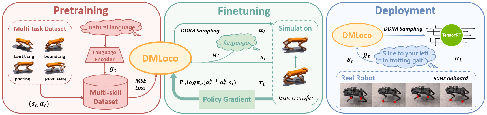

# DMLoco: Integrating Diffusion-based Multi-task Learning with Online Reinforcement Learning for Robust Quadruped Robot Control

## Introduction
We propose DMLoco, a novel framework that integrates Diffusion-based Multi-task pretraining with online Proximal Policy Optimization (PPO) finetuning for quadruped Locomotion. Our approach first leverages the powerful representation capacity of diffusion models to learn a language-conditioned policy from diverse expert datasets. Subsequently, we enhance robustness and enable stable gait transitions through PPO finetuning in simulation, even in the absence of explicit transition data. By employing Denoising Diffusion Implicit Models (DDIM) for efficient sampling and TensorRT for optimized onboard deployment, our policy achieves real-time inference at 50Hz, making it practical for deployment on physical platforms.



## Install
```
git clone
cd DMLoco
conda create -n dmloco python=3.8
conda activate dmloco
pip install requirements.txt
```

## Usage
```
# Pretrain
python script/run.py --config-name=pre_diffusion_unet --config-dir=cfg/aliengo/pretrain/multi_gait_and_vel
# Eval
python script/performance.py --config-name=eval_diffusion_unet --config-dir=cfg/aliengo/eval/multi_gait_and_vel
# Finetune
python script/run.py --config-name=ft_ppo_diffusion_unet --config-dir=cfg/aliengo/finetune/multi_gait_and_vel
```

## Acknowledgement
[DPPO](https://github.com/irom-princeton/dppo): code base for traning

[Walk these ways](https://github.com/Improbable-AI/walk-these-ways): gym env for quadruped robot